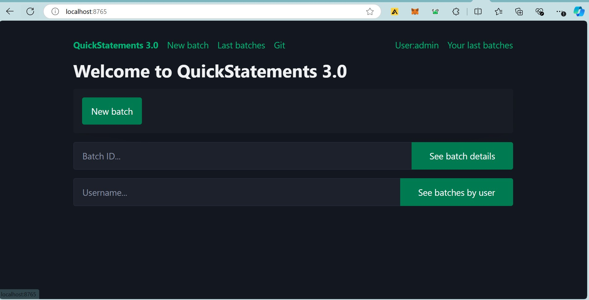

# What is Quickstatements?
[Quickstatements]( https://quickstatements.toolforge.org) is a tool used to batch-edit wikidata data using a simple, easy-to-understand tabular syntax.

While creating and editing individual Wikidata items manually can be done easily, handling a large volume of items can be very challenging. It is a time-consuming, repetitive, and inefficient task. 

Quickstatements solves this problem. With Quickstatements, one can create or edit several items at once by grouping them into a batch. The edits are done simultaneously. 

To truly appreciate Quickstatements and the problem it solves, a basic understanding of Wikidata, what it solves, Wikidata concepts, and editing of Wikidata items is required. A good starting point is [Why Wikidata Exists](https://medium.com/@nyerhovwoonitcha/wikidata-in-5-minutes-93d38906ff91).


##  The Quickstatement Homepage
Quickstatements' homepage is easy to naviagte, most of the features are displayed on the homepage to ensure ease of use and easy navigation. These features include:
- Login
- New Batch
- See Batch Details
- See Batches by User
- Your Last Batches
- Git




### 1- Login
A user logs into [Quickstatements]( https://quickstatements.toolforge.org) using their Wikidata credentials. If the user doesn't have a [wikidata account](https://www.wikidata.org/wiki/Wikidata:Main_Page), they would need to create one.

### 2- New Batch:
The **new batch** button opens a field to import the dataset that is to be edited or created on wikidata. The dataset is prepared beforehand in a specific tabular format using programs like microsoft excel or google sheets as seen below.


<video width="320" height="240" controls>
  <source src="../outreachy/videos/new batch.mp4" type="video/mp4">
  Your browser does not support the video tag.
</video>


### 3- See Batch Details
This displays the details of any batch when the Batch ID is entered. 

### 4- See Batches by User: 
This displays the most recent batches run by a specific wikidata user when the username is entered into the provided field.


### 5- Your Last Batches
This displays a list of the most recent batches run by the current logged-in user. 
Along with the list, it also displays statistics like:

```
DONE: The number of statements that were successfully run
ERROR: The number of statements that failed
INIT: The number of statements left to run
RUN: The number of statements being run right now
```

### 6- Last Batches
This feature displays a list of the most recent batches run by other Wikidata users. Since many Wikidata editors are self-taught volunteers, this functionality allows more experienced editors to review and analyze ongoing batch edits.
 

This functionality has the option to open a public discussion about a batch edit or to revert the batch edit completely.

### 7- Git
This link directs the user to Quickstatements project repository on Github. The user can report issues or check for updates on the Quickstatement repository.

### Example of Quickstatements in use:
<video width="320" height="240" controls>
  <source src="../outreachy/files/Quickstatements in use.mp4" type="video/mp4">
  Your browser does not support the video tag.
</video>


To learn more about Quickstatments and how it's used:

[Official Quickstatements Guide](https://www.wikidata.org/wiki/Help:QuickStatements)

[wikimedia Quickstatements Tutorial](https://www.mediawiki.org/wiki/Wikidata_QuickStatements_Tutorial)


